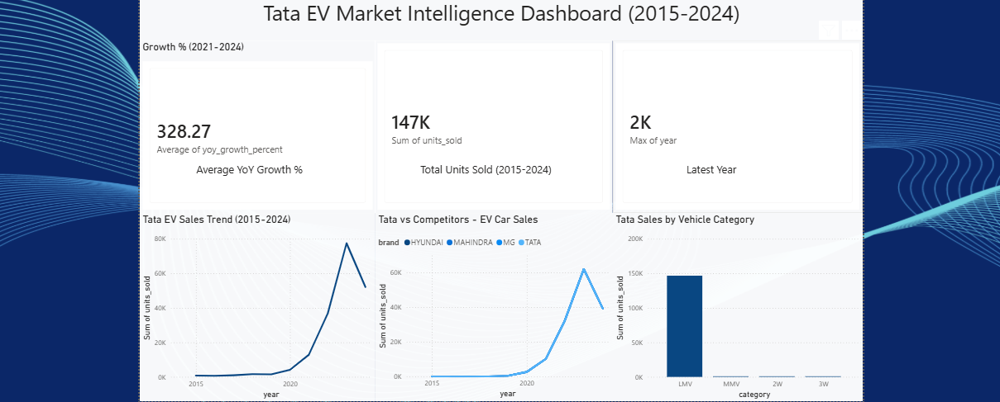
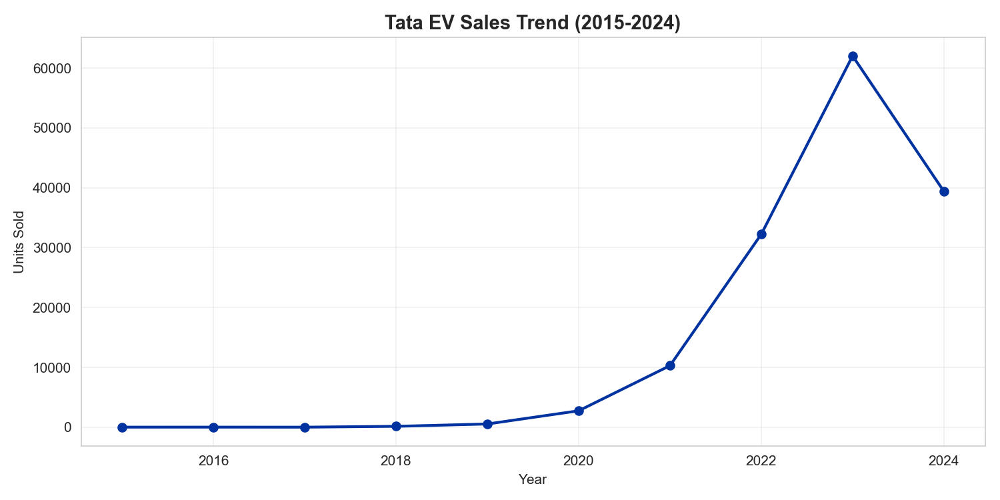
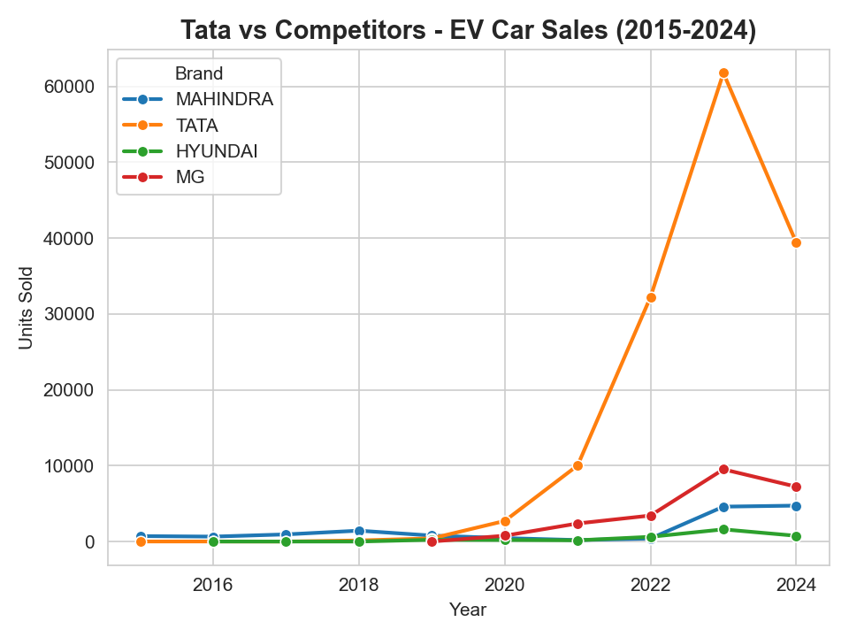

# 🚗⚡ Tata EV Market Intelligence & Sales Analytics

An end-to-end data analytics project analyzing Tata Motors' EV market performance in India (2015–2024) using **SQL, Python, and Power BI**. The project covers the full pipeline — from raw government EV registration data to a clean, interactive business dashboard.



---

## 📌 Project Overview

India's EV market has grown rapidly since 2020, and Tata Motors has emerged as the clear market leader in the electric car (LMV) segment. This project analyzes 10 years of EV sales data across manufacturers, states, and vehicle categories to answer:

- How has Tata's EV sales trend evolved from 2015 to 2024?
- How does Tata compare against competitors (Hyundai, Mahindra, MG)?
- Which vehicle category drives most of Tata's EV sales?
- What does India's charging infrastructure look like?
- What can we forecast for the next 1–2 years?

---

## 🛠️ Tech Stack


- **MySQL** — database design, data cleaning, and aggregation queries
- **Python (Pandas, Matplotlib, Seaborn, Scikit-learn)** — EDA, visualization, and sales forecasting
- **Power BI** — interactive dashboard with KPIs, trend charts, and comparisons

---

## 🗂️ Project Structure

```
Tata EV Market Intelligence & Sales Analytics/
├── sql/
│   ├── 01_schema_setup.sql        # Database & table creation
│   └── 02_analysis_queries.sql    # 8 analysis queries
├── notebook/
│   └── Tata_EV_Analysis.ipynb     # Full Python analysis & forecasting
├── power bi/
│   └── Tata_EV_Market_Intelligence_Dashboard.pbix
├── dataset/
│   ├── ev_sales_by_maker.csv
│   ├── ev_makers.csv
│   ├── charging_stations.csv
│   ├── vehicle_class_totals.csv
│   └── ev_category_trend.csv
├── images/
│   ├── power_bi_dashboard.png
│   ├── tata_sales_trend.png
│   ├── tata_vs_competitors.png
│   └── tata_by_category.png
└── README.md
```

---

## 🔍 Data Source

Dataset sourced from **Kaggle**, originally compiled from India's **Vahan Dashboard** (Ministry of Road Transport & Highways). Covers manufacturer-wise sales, vehicle categories, state-wise charging infrastructure, and overall vehicle registrations from 2015–2024.

---

## ⚙️ Workflow

**1. SQL — Database Design & Querying**
Raw CSVs were loaded into a MySQL database with 5 normalized tables. Queries were written to extract Tata's year-wise sales trend, category-wise breakdown, and competitor comparisons.

**2. Python — Data Cleaning & Analysis**
Connected to MySQL using SQLAlchemy, cleaned the data (Tata's EV business appears under **3 different legal entity names** across the years due to corporate restructuring — all were consolidated into a single "TATA" label), performed EDA, and built a simple Linear Regression model to forecast 2025–2026 sales.

**3. Power BI — Dashboard**
Built an interactive dashboard with KPI cards, a sales trend line chart, a Tata-vs-competitors comparison, and a category-wise breakdown — styled with a blue theme to reflect Tata's brand identity.

---

## 📊 Key Insights

- **147,000+ units** sold by Tata EVs between 2015–2024, overwhelmingly in the **LMV (passenger car)** segment.
- Tata's EV sales stayed **negligible until 2019** (under 550 units/year), then grew explosively after the **Nexon EV launch**, jumping from ~2,700 units in 2020 to **62,000+ units in 2023**.
- Since 2020, Tata has consistently outsold its nearest competitor (**MG Motor**) by **5–9x**, establishing clear market leadership in India's EV car segment.
- **2024 saw a market-wide slowdown** — not just for Tata, but for MG as well — suggesting a broader dip in EV car demand rather than a Tata-specific issue.
- Forecast model projects continued strong (though moderating) demand into 2025–2026 based on the 2020–2024 growth trajectory.

---

## 📈 Dashboard Preview




---

## 🚀 How to Run This Project

1. **SQL**: Run `01_schema_setup.sql` in MySQL, then import the CSVs from `/dataset` into their respective tables. Run `02_analysis_queries.sql` to explore the data.
2. **Python**: Open `Tata_EV_Analysis.ipynb` in Jupyter Notebook, update the MySQL connection string with your own credentials, and run all cells.
3. **Power BI**: Open `Tata_EV_Market_Intelligence_Dashboard.pbix` in Power BI Desktop and refresh the data source to point to your local CSVs.

---

## 🙋 About Me

**Gaurav Bisen**
*Aspiring Data Analyst*

🔗 [LinkedIn](https://www.linkedin.com/in/gaurav-bisen-18a1b1378)
🔗 [GitHub](https://github.com/GauravBisen15)

---

⭐ If you found this project useful, consider giving it a star!
